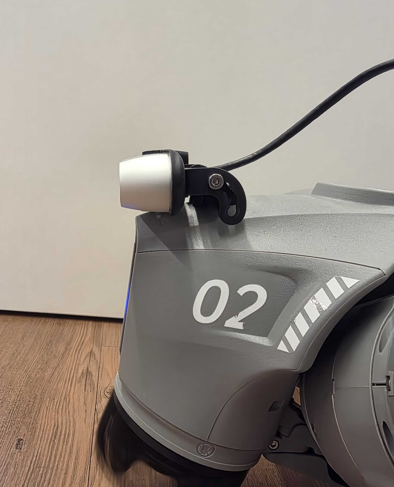

# Go2 Local Setup Guide

A step-by-step guide for setting up BotBrain on the Unitree Go2 EDU Docking Station.

---

## Table of Contents

- [Hardware Setup](#hardware-setup)
- [Software Setup](#software-setup)
  - [Step 1 — Internet Connectivity](#step-1--internet-connectivity)
  - [Step 2 — Clone the BotBrain Repository](#step-2--clone-the-botbrain-repository)
  - [Step 3 — Boot Procedure](#step-3--boot-procedure)

---

## Hardware Setup

### Docking Station

Mount the docking station as provided in Unitree's official instructions.

### RealSense Camera

Mount the RealSense camera according to the image below:



> **Important:** By default, the mounting bracket is screwed into the bottom hole of the mount. Move it to the top hole as shown in the image above. Also ensure the RealSense is flush against the robot's head. This placement matches the transform offsets used in the software configuration.

---
## Software Setup

### Step 1 — Internet Connectivity

The docking station's Jetson that comes with Go2W and Go2Edu versions does not come with a WiFi card. Installing and utilizing BotBrain requires an internet connection, so a solution is provided in this guide.

### WiFi Dongle Compatibility

Not all WiFi dongles work out of the box on the docking station. The table below summarizes tested options:

| Dongle | Status | Notes |
|--------|--------|-------|
| ALFA AWUS036NHA (Atheros AR9271) | ❌ Does not work | Generates current overload |
| Nano TP-Link AC600 Archer T2U Dual Band | ✅ Works | Driver must be installed manually (see below) |

### Recommended: Wi-Fi USB Nano TP-Link AC600 Archer T2U Dual Band

Purchase a **Wi-Fi USB Nano TP-Link AC600 Archer T2U Dual Band**. The driver for this dongle is not natively available on the docking station and must be downloaded and installed once before the dongle can be used.

**First-time setup — driver installation via Ethernet:**

Since the dongle's driver is not pre-installed, you will need a temporary internet connection to download it. Connect the Jetson directly to your router or laptop via an Ethernet cable for this one-time step.

> **Note:** Routing internet traffic through the Ethernet interface may require additional network configuration on the Jetson (e.g. setting a default gateway, configuring a static IP on the `eth` interface, or enabling IP forwarding on the host machine if sharing a laptop's connection). Once the driver is installed and internet is configured through WiFi, the Ethernet cable can be removed and the WiFi dongle used for all subsequent connections.

Once connected via Ethernet, install the driver:

```bash
sudo apt update
sudo apt install dkms
git clone -b v5.6.4.2 https://github.com/aircrack-ng/rtl8812au.git
cd rtl8812au
sudo ./dkms-install.sh
```

### Using a Different Dongle

Feel free to use a different WiFi dongle if you prefer. Keep in mind that drivers may not be pre-installed, so the same Ethernet-first approach described above will likely apply. If you test a dongle and confirm whether it works or not, we'd love for you to contribute your findings to the compatibility table above — open a PR or file an issue on the [BotBrain repository](https://github.com/botbotrobotics/BotBrain).

---

### Step 2 — Clone the BotBrain Repository

Clone the BotBrain repository using the `feature/go2_local` branch:

```bash
git clone -b feature/go2_local https://github.com/botbotrobotics/BotBrain.git
```

Then follow the standard BotBrain installation steps as described in [installation-guide.md](./installation-guide.md).

> **Why this branch?**
>
> The `feature/go2_local` branch contains two changes specific to this hardware configuration:
>
> - **Camera transform offsets** — On the docking station, the RealSense camera is mounted on the robot's head rather than inside the BotBrain enclosure. The position transform parameters in the camera config have been adjusted to match this physical placement.
>
> - **RTABMap `initial_reset` patch** — JetPack 5.x (present on the docking station) does not support launching RTABMap with `initial_reset: True`, which is used in every other BotBrain robot configuration to initialize the RealSense properly. This branch removes that parameter for the Go2 local setup.

---

### Step 3 — Boot Procedure

> **Important:** This procedure must be repeated every time the robot boots.

This is required as a workaround for the unsupported `initial_reset` behavior on JetPack 5.x.

1. Open BotBrain and navigate to the **Health** tab.
2. Wait for all nodes to activate properly.
2. Find the **Front Camera** node and restart it.
3. Wait until the **Front Camera** node status shows **active**.
4. Find the **Controller Server (Nav2)** node and restart it.

> **Note:** Restarting the Controller Server node will cascade-restart several nodes below it. This is expected behavior. If the following nodes are not restarted automatically, you can do that manually.
