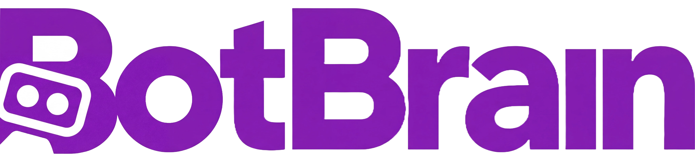
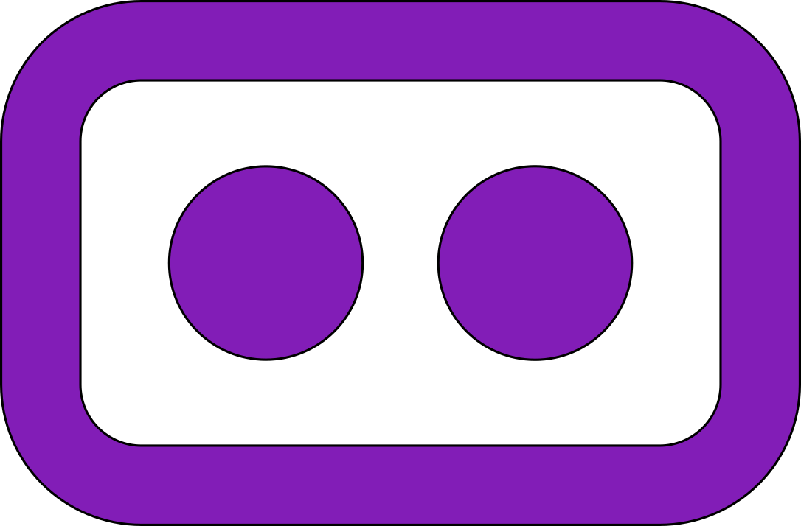
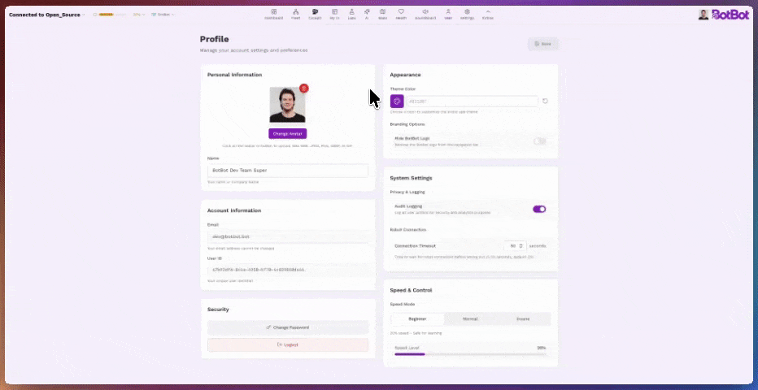

<!-- LOGO -->
<p align="center">
  <a href="https://botbot.bot" target="_blank">
    
  </a>
</p>

<p align="center">
  Um Cérebro, qualquer Robô.
</p>

<p align="center">
  
  
  
  
</p>

<p align="center">
  <a href="https://botbot.bot"></a>
  <a href="https://discord.gg/CrTbJzxXes"></a>
  <a href="https://www.linkedin.com/company/botbotrobotics"></a>
  <a href="https://www.youtube.com/@botbotrobotics"></a>
</p>

<p align="center">
  <a href="../../README.md"></a>
  <a href="README_pt.md"></a>
  <a href="README_fr.md"></a>
  <a href="README_zh-CN.md"></a>
  <a href="README_es.md"></a>
</p>

> **Nota:** A versão em inglês é a documentação oficial e mais atualizada. Esta tradução pode não refletir as últimas alterações.

# BotBrain Open Source (BBOSS) 

BotBrain é uma coleção modular de componentes de software e hardware de código aberto que permite dirigir, ver, mapear, navegar (manualmente ou de forma autônoma), monitorar e gerenciar robôs com pernas (quadrúpedes, bípedes e humanoides) ou robôs com rodas ROS2 a partir de uma interface web simples, mas poderosa. O hardware fornece suportes imprimíveis em 3D e uma carcaça externa para que você possa instalar o BotBrain no seu robô sem complicações.

- Projetado em torno do Intel RealSense D435i e da linha NVIDIA Jetson
- Placas oficialmente suportadas: Jetson Nano, Jetson Orin Nano (suporte para AGX e Thor em breve)
- Tudo é modular - você não precisa executar todos os módulos (alguns módulos pesados de IA requerem Orin AGX)

<h2 align="center">✨ Recursos em Destaque</h2>

<table>
  <tr>
    <td align="center" width="50%">
      <br>
      <h3>Dashboard e Controle de Frota</h3>
      <p>Dashboard completo para ver status, informações do robô e acessar rapidamente outras seções</p>
    </td>
    <td align="center" width="50%">
      <br>
      <h3>CockPit</h3>
      <p>Página de controle predefinida com câmeras frontal/traseira, modelo 3D, mapa e navegação, além de controles rápidos</p>
    </td>
  </tr>
  <tr>
    <td align="center" width="50%">
      <br>
      <h3>Minha Interface</h3>
      <p>Interface de controle personalizável com todos os recursos do cockpit</p>
    </td>
    <td align="center" width="50%">
      <br>
      <h3>Missões</h3>
      <p>Crie missões para o robô executar e navegar de forma autônoma</p>
    </td>
  </tr>
  <tr>
    <td align="center" width="50%">
      <br>
      <h3>Saúde do Sistema</h3>
      <p>Visualize a saúde completa do BotBrain: uso de CPU/GPU/RAM, controle e status dos nós da máquina de estados, controle de conexão Wi-Fi</p>
    </td>
    <td align="center" width="50%">
      <br>
      <h3>Perfil do Usuário</h3>
      <p>Personalize a aparência do BotBrain, defina cores personalizadas e perfis de velocidade</p>
    </td>
  </tr>
</table>

<p align="center">
  <br>
  <h3 align="center">Hardware de Código Aberto</h3>
  <p>Rápido para imprimir em 3D, fácil de montar e projetado para encaixar em qualquer robô.
  Coloque seu robô funcionando com o BotBrain em menos de 30 minutos.</p>
</p>

<p align="center">
  <a href="https://youtu.be/VBv4Y7lat8Y">📹 Assista o BotBrain completar 1 hora de patrulhas autônomas em nosso escritório</a>
</p>


## Lista Completa de Recursos

### Suporte Multi-Robô

- **Unitree Go2 & Go2-W** - Robôs quadrúpedes com interface de hardware e controle completos
- **Unitree G1** - Humanoide com controle de postura do corpo superior e transições FSM
- **DirectDrive Tita** - Bípede com controle completo
- **Robôs personalizados** - Framework extensível para adicionar qualquer plataforma compatível com ROS2
- **Com pernas e rodas** - Arquitetura suporta ambos os tipos de locomoção

### Hardware e Sensores

- **Carcaça imprimível em 3D** - Design de encaixe com adaptadores de montagem específicos para cada robô (Go2, G1 e Direct drive Tita)
- **Intel RealSense D435i** - Suporte a duas câmeras para visualização e SLAM/Navegação
- **IMU e odometria** - Estimativa de pose em tempo real de todas as plataformas suportadas
- **Monitoramento de bateria** - Estado da bateria por robô com estimativa de autonomia

### IA e Percepção

- **Detecção de objetos YOLOv8/v11** - Mais de 80 classes, otimizado com TensorRT, rastreamento em tempo real no BotBrain
- **Moondream AI** - Compreensão de visão multimodal e análise de cena
- **Controle por linguagem natural ROSA** - Comandos conversacionais para o robô via LLM
- **Histórico de detecções** - Log pesquisável com imagem e informação/descrição

### Navegação Autônoma

- **RTABMap SLAM** - Mapeamento visual com uma ou duas câmeras RealSense D435i
- **Integração Nav2** - Planejamento de trajetória, desvio de obstáculos dinâmicos, comportamentos de recuperação
- **Planejamento de missões** - Crie e execute patrulhas autônomas com múltiplos waypoints
- **Navegação por clique** - Defina destinos diretamente na interface do mapa
- **Gerenciamento de mapas** - Salve, carregue, troque e defina posições iniciais

### Orquestração do Sistema

- **Gerenciamento de ciclo de vida** - Inicialização/desligamento coordenado de nós com ordenação de dependências
- **Máquina de estados** - Estados do sistema com liga/desliga automático
- **Controle de velocidade por prioridade** - Arbitragem de comandos em 6 níveis (joystick > nav > IA)
- **Interruptor de segurança** - Trava de segurança de hardware/software para todos os comandos de movimento
- **Parada de emergência** - Sequência abrangente de e-stop

### Interfaces de Controle

- **CockPit** - Página de controle pré-configurada com câmeras, modelo 3D, mapa e ações rápidas
- **Minha Interface** - Dashboard personalizável com arrastar e soltar e widgets redimensionáveis
- **Joysticks virtuais** - Controle de duplo stick por toque/mouse com ajuste de velocidade
- **Suporte a gamepad** - PS5, Xbox ou joystick genérico com mapeamento de botões personalizado e troca de modo
- **Controle por teclado** - Controles WASD
- **Perfis de velocidade** - Múltiplas predefinições de velocidade para diferentes modos operacionais (Iniciante, Normal e modo Insano)
- **Ações do robô** - Levantar/sentar, travar/destravar, seleção de marcha, luzes, transições de modo

### Câmera e Vídeo

- **Streaming multi-câmera** - Descoberta dinâmica para tópicos de câmera frontal, traseira e personalizados
- **Codecs H.264/H.265** - Escala de resolução, controle de taxa de quadros, otimização de largura de banda
- **Gravação no navegador** - Grave vídeo das câmeras e salve na pasta de downloads
- **Visualização 3D** - Modelo do robô baseado em URDF com sobreposição de varredura laser e caminho de navegação

### Monitoramento do Sistema

- **Estatísticas Jetson** - Modelo da placa, versão do JetPack, modo de energia, tempo de atividade
- **Monitoramento de CPU/GPU** - Uso por núcleo, frequência, memória, limitação térmica
- **Rastreamento de energia** - Tensão, corrente e potência por trilho com detecção de pico
- **Temperaturas e ventiladores** - Temperaturas de CPU/GPU/SOC com controle de velocidade do ventilador
- **Armazenamento e memória** - Alertas de uso de disco, monitoramento de RAM/swap

### Rede e Frota

- **Painel de controle Wi-Fi** - Varredura de redes, troca e monitoramento de sinal
- **Modos de conexão** - Wi-Fi, Ethernet, 4G, hotspot com rastreamento de latência
- **Frota multi-robô** - Conexões simultâneas, comandos para toda a frota, dashboard de status
- **Diagnósticos** - Saúde dos nós, logs de erro/aviso, visualização da máquina de estados

### Personalização e UX

- **Temas claro/escuro** - Cores de destaque personalizadas, preferências persistentes
- **Layouts responsivos** - Mobile, tablet e desktop com suporte a toque
- **Perfis de usuário** - Avatar, nome de exibição, cor do tema via Supabase Auth
- **Multi-idioma** - Inglês e Português com formatos regionais
- **Registro de auditoria** - Histórico de eventos pesquisável em mais de 10 categorias com exportação CSV
- **Análise de atividade** - Mapas de calor de uso e rastreamento de utilização do robô

## Índice

- [Visão Geral](#visão-geral)
- [Estrutura do Projeto](#estrutura-do-projeto)
- [Requisitos](#requisitos)
- [Instalação](#instalação)
  - [Configuração do Hardware](#1-configuração-do-hardware)
  - [Configuração do Supabase](#2-configuração-do-supabase)
  - [Configuração do Software](#3-configuração-do-software)
- [Desenvolvimento Frontend](#desenvolvimento-frontend)
- [Recursos](#recursos)
- [Configuração](#configuração)
- [Robôs Personalizados](#adicionar-suporte-para-outros-robôs--robôs-personalizados)
- [Solução de Problemas](#solução-de-problemas)
- [Contribuindo](#contribuindo)
- [Licença](#licença--citação)

## Visão Geral

O BotBrain consiste em três componentes principais:

### Hardware
Uma carcaça imprimível em 3D com suportes internos projetados para abrigar uma placa NVIDIA Jetson e duas câmeras Intel RealSense D435i. O design modular permite que você conecte o BotBrain a várias plataformas de robôs sem fabricação personalizada.

### Frontend
Um dashboard web Next.js 15 construído com React 19 e TypeScript. Ele fornece controle do robô em tempo real, streaming de câmera, visualização de mapa, planejamento de missões, monitoramento do sistema e gerenciamento de frota—tudo acessível a partir de qualquer navegador na sua rede.

### Robô (Workspace ROS2)
Uma coleção de pacotes ROS2 Humble que gerenciam:
- **Bringup e Orquestração** (`bot_bringup`) - Lançamento e coordenação do sistema
- **Localização** (`bot_localization`) - SLAM baseado em RTABMap para mapeamento e posicionamento
- **Navegação** (`bot_navigation`) - Integração Nav2 para movimento autônomo
- **Percepção** (`bot_yolo`) - Detecção de objetos YOLOv8/v11
- **Drivers de Robô** - Pacotes específicos de plataforma para Unitree Go2/G1, DirectDrive Tita e robôs personalizados

---

## Estrutura do Projeto

```
BotBrain/
├── frontend/          # Dashboard web Next.js 15 (React 19, TypeScript)
├── botbrain_ws/       # Workspace ROS 2 Humble
│   └── src/
│       ├── bot_bringup/          # Lançamento principal e orquestração do sistema
│       ├── bot_custom_interfaces/# Mensagens, serviços e ações ROS 2 personalizados
│       ├── bot_description/      # Modelos URDF/XACRO e robot_state_publisher
│       ├── bot_jetson_stats/     # Monitoramento de hardware Jetson
│       ├── bot_localization/     # SLAM RTABMap
│       ├── bot_navigation/       # Navegação autônoma Nav2
│       ├── bot_rosa/             # Controle por linguagem natural ROSA AI
│       ├── bot_state_machine/    # Gerenciamento de ciclo de vida e estados
│       ├── bot_yolo/             # Detecção de objetos YOLOv8/v11
│       ├── g1_pkg/               # Suporte Unitree G1
│       ├── go2_pkg/              # Suporte Unitree Go2
│       ├── joystick-bot/         # Interface de controle (gamepad)
│       └── tita_pkg/             # Suporte DirectDrive Tita
├── hardware/          # Carcaça imprimível em 3D (STL/STEP/3MF)
└── docs/              # Documentação
```

---

## Requisitos

### Hardware

| Componente | Requisito |
|-----------|-------------|
| **Computação** | NVIDIA Jetson (Nano, Orin Nano ou série AGX) |
| **Câmeras** | 2x Intel RealSense D435i |
| **Robô** | Robô ROS2 Humble ou Unitree Go2 e Go2-W, Unitree G1, Direct Drive Tita, ou [robô personalizado](../../botbrain_ws/README.md#creating-a-custom-robot-package) |
| **Rede** | Conexão Ethernet ou WiFi |

### Software

| Componente | Requisito |
|-----------|-------------|
| **SO** | JetPack 6.2 (Ubuntu 22.04) recomendado |
| **Container** | Docker & Docker Compose |
| **Node.js** | v20+ (apenas para desenvolvimento frontend local) |

---

## Instalação

O BotBrain tem dois componentes principais: **hardware** (carcaça impressa em 3D e componentes internos) e **software** (aplicação web frontend e workspace ROS2).

### 1. Configuração do Hardware

Imprima a carcaça em 3D e monte os componentes eletrônicos.

**Peças Principais:** Impressora 3D, filamento PLA, NVIDIA Jetson, 2x RealSense D435i, conversor de tensão.

> **[Guia de Montagem do Hardware](hardware/README_pt.md)** - Instruções detalhadas sobre como construir seu BotBrain
>
> **[Vídeo Completo de Montagem](https://youtu.be/xZ5c619bTEQ)** - Passo a passo completo em vídeo do processo de montagem do BotBrain

### 2. Configuração do Supabase

O dashboard web requer Supabase para autenticação e armazenamento de dados. Você precisará criar seu próprio projeto Supabase gratuito.

> **[Guia de Configuração do Supabase](../SUPABASE_SETUP.md)** - Instruções completas com esquema do banco de dados

**Resumo rápido:**
1. Crie um projeto em [supabase.com](https://supabase.com)
2. Execute as migrações SQL do guia de configuração
3. Copie suas chaves de API para o próximo passo

### 3. Configuração do Software

#### Dependências Externas

**Sistema Operacional:**
- **NVIDIA JetPack 6.2** (recomendado)
- Outras distribuições Linux podem funcionar, mas não são oficialmente suportadas

**Docker & Docker Compose:**

Necessário para implantação containerizada:

1. Instale o Docker:

```bash
# Adicione a chave GPG oficial do Docker:
sudo apt-get update
sudo apt-get install ca-certificates curl
sudo install -m 0755 -d /etc/apt/keyrings
sudo curl -fsSL https://download.docker.com/linux/ubuntu/gpg -o /etc/apt/keyrings/docker.asc
sudo chmod a+r /etc/apt/keyrings/docker.asc

# Adicione o repositório às fontes do Apt:
echo \
  "deb [arch=$(dpkg --print-architecture) signed-by=/etc/apt/keyrings/docker.asc] https://download.docker.com/linux/ubuntu \
  $(. /etc/os-release && echo "$VERSION_CODENAME") stable" | \
  sudo tee /etc/apt/sources.list.d/docker.list > /dev/null
sudo apt-get update

# Instale os pacotes Docker:
sudo apt-get install docker-ce docker-ce-cli containerd.io docker-buildx-plugin docker-compose-plugin
```

Veja o [guia oficial de instalação do Docker](https://docs.docker.com/engine/install/ubuntu/#install-using-the-repository) para mais detalhes.

2. Habilite o Docker sem sudo:

```bash
sudo groupadd docker
sudo usermod -aG docker $USER
newgrp docker
```

Veja os [passos pós-instalação](https://docs.docker.com/engine/install/linux-postinstall/) para mais detalhes.

#### Passos de Instalação

**Passo 1: Clone o Repositório**

```bash
git clone https://github.com/botbotrobotics/BotBrain.git
cd BotBrain
```

**Passo 2: Execute o Script de Instalação**

O script de instalação automatizado irá configurar seu robô e configurar o serviço de autostart:

```bash
sudo ./install.sh
```
Mais detalhes sobre as informações solicitadas no instalador podem ser encontrados [aqui](../installation-guide.md)

**Passo 3: Reinicie o Sistema**

```bash
sudo reboot
```

Uma vez reiniciado, o sistema iniciará automaticamente os containers Docker para todos os nós ROS2 e o servidor web.

**Passo 4: Acesse a Interface Web**

| Método de Acesso | URL |
|---------------|-----|
| Mesmo computador | `http://localhost` |
| Acesso pela rede | `http://<IP_DO_JETSON>` |

Encontre o endereço IP do seu Jetson:
```bash
hostname -I
```

> **Nota:** Certifique-se de que ambos os dispositivos estão na mesma rede e que a porta 80 não está bloqueada por um firewall.

---

## Desenvolvimento Frontend

Para desenvolvimento frontend local (sem a stack completa do robô):

### Configuração

```bash
cd frontend

# Copie o template de ambiente
cp .env.example .env.local

# Edite com suas credenciais Supabase
nano .env.local
```

### Variáveis de Ambiente

| Variável | Obrigatória | Descrição |
|----------|----------|-------------|
| `NEXT_PUBLIC_SUPABASE_URL` | Sim | URL do seu projeto Supabase |
| `NEXT_PUBLIC_SUPABASE_ANON_KEY` | Sim | Chave anon/pública do seu Supabase |
| `NEXT_PUBLIC_ROS_IP` | Não | IP padrão do robô (padrão: 192.168.1.95) |
| `NEXT_PUBLIC_ROS_PORT` | Não | Porta do ROS bridge (padrão: 9090) |

### Executando

```bash
# Instale dependências
npm install

# Servidor de desenvolvimento (recursos completos)
npm run dev

# Servidor de desenvolvimento (edição open source)
npm run dev:oss

# Build de produção
npm run build
npm start
```
---

## Configuração

### Configuração do Robô

Edite `botbrain_ws/robot_config.yaml`:

```yaml
robot_configuration:
  robot_name: "meu_robo"           # Namespace para todos os tópicos
  robot_model: "go2"               # go2, tita, g1, ou personalizado
  network_interface: "eth0"        # Interface de rede para ROS2
  openai_api_key: ""               # Para recursos de IA (opcional)
```

### Configuração de Câmeras

Os números de série das câmeras e transformações são configurados por robô em:
- `botbrain_ws/src/go2_pkg/config/camera_config.yaml`
- `botbrain_ws/src/g1_pkg/config/camera_config.yaml`
- `botbrain_ws/src/tita_pkg/config/camera_config.yaml`

Encontre os números de série das suas câmeras:
```bash
rs-enumerate-devices | grep "Serial Number"
```

---

## Adicionar Suporte para Outros Robôs / Robôs Personalizados

Para adicionar suporte para uma nova plataforma de robô ao BotBrain:

1. **Backend/Stack ROS2**: Siga o guia completo [Criando um Pacote de Robô Personalizado](../../botbrain_ws/README.md#creating-a-custom-robot-package)
2. **Frontend**: Adicione um perfil de robô nas configurações da interface web

---

## Solução de Problemas

### Conexão WebSocket Falhou
- Verifique se o rosbridge está em execução: `ros2 node list | grep rosbridge`
- Verifique se o firewall permite a porta 9090: `sudo ufw allow 9090`
- Certifique-se de que o IP está correto nas configurações de conexão do robô na interface

### Câmera Não Detectada
- Liste as câmeras conectadas: `rs-enumerate-devices`
- Verifique as conexões USB e certifique-se de que as câmeras têm energia
- Verifique se os números de série em `camera_config.yaml` correspondem às suas câmeras
- Verifique as permissões USB: `sudo usermod -a -G video $USER`

### Problemas com Docker
- Certifique-se de que o Docker roda sem sudo (veja instruções de instalação)
- Verifique o acesso à GPU: `docker run --gpus all nvidia/cuda:11.0-base nvidia-smi`
- Veja os logs do container: `docker compose logs -f bringup`

### Frontend Não Carrega
- Verifique as credenciais Supabase em `.env.local`
- Verifique o console do navegador para erros
- Certifique-se de que o Node.js v20+ está instalado: `node --version`

### Robô Não Se Move
- Verifique se o twist_mux está em execução: `ros2 topic echo /cmd_vel_out`
- Verifique se a interface de hardware do robô está ativa: `ros2 lifecycle get /robot_write_node`
- Verifique se a parada de emergência está acionada na interface

### Precisa de Mais Ajuda?
Junte-se à nossa [comunidade no Discord](https://discord.gg/CrTbJzxXes) para suporte em tempo real e discussões com a comunidade BotBrain.

---

## Bibliotecas de Terceiros

Veja [docs/DEPENDENCIES.md](../DEPENDENCIES.md) para uma lista completa dos pacotes frontend e ROS utilizados.

---

## Contribuindo

Aceitamos contribuições! Seja corrigindo bugs, adicionando recursos, melhorando documentação ou adicionando suporte para novos robôs, sua ajuda é apreciada. Se você pode tornar o BotBrain melhor ou mais rápido, traga sua contribuição.

Junte-se ao nosso [servidor Discord](https://discord.gg/CrTbJzxXes) para discutir ideias, obter ajuda ou coordenar com outros contribuidores.

### Fluxo de Desenvolvimento

1. **Faça um Fork do Repositório**
   ```bash
   # Faça fork via interface do GitHub, depois clone seu fork
   git clone https://github.com/botbotrobotics/BotBrain.git
   cd BotBrain
   ```

2. **Crie uma Branch de Feature**
   ```bash
   git checkout -b feature/seu-recurso-incrivel
   ```

3. **Faça Suas Alterações**
   - Adicione testes para novas funcionalidades
   - Atualize os arquivos README relevantes
   - Certifique-se de que todos os pacotes compilam com sucesso
   - Siga os padrões de codificação ROS 2

4. **Teste Completamente**

5. **Faça Commit das Suas Alterações**
   ```bash
   git add .
   git commit -m "Add feature: breve descrição das alterações"
   ```

6. **Envie para Seu Fork**
   ```bash
   git push origin feature/seu-recurso-incrivel
   ```

7. **Envie um Pull Request**
   - Forneça uma descrição clara das suas alterações
   - Referencie quaisquer issues relacionadas
   - Inclua screenshots ou vídeos para alterações de UI/comportamento

---

## BotBrain Pro

<p align="center">
  
</p>

Versão Profissional / Enterprise do BotBrain com proteção IP67, payloads personalizados como CamCam (Câmera Térmica + Infravermelho), ZoomZoom (câmera RGB de longo alcance 30x), modelos de IA avançados, integração IoT (LoRA), conectividade de dados 3-5g, serviço e manutenção, integrações avançadas com payloads personalizados, e muito mais. [Saiba mais aqui](https://botbot.bot).

---

## Segurança

Robôs podem machucar pessoas e a si mesmos quando operados incorretamente ou durante o desenvolvimento. Por favor, observe estas práticas de segurança:

- **Use um E-stop físico** - Nunca confie apenas em paradas por software
- **Rotacione chaves de API** se vazarem
- **Teste alterações em simulação** antes de rodar no hardware físico
- **Mantenha distância do robô** durante os testes iniciais

> **Aviso:** A BotBot não é responsável por quaisquer falhas, acidentes ou danos resultantes do uso deste software ou hardware. O usuário assume total responsabilidade pela operação segura, teste e implantação de robôs usando o BotBrain.

---

## Licença

Este projeto está licenciado sob a **Licença MIT** - veja o arquivo [LICENSE](../LICENSE) para detalhes.

---

<p align="center">Feito com 💜 no Brasil</p>

<p align="right">
  
</p>
